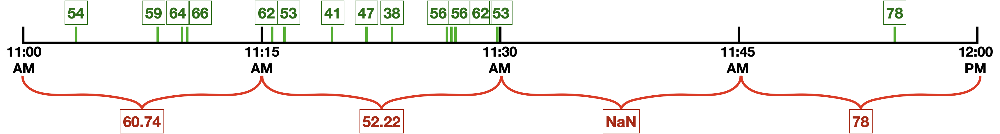

## Data Synchronization

This notebook provides consistency between source and target data stores, and the continuous harmonization of the data over time. This repository perform synchronization on PM2.5 data but can be easily modified for any other pollutant.

- Divide time series data into 15mins time windows.
- Aggregate data for every 15mins.
- If there are multiple observations in the given time period, mean will be taken.
- If there are no observations in the given time period, NaN will be taken.

### Python Packages

- Numpy
- Pandas
- Statsmodels
- scikit-learn
- Seaborn
- Matplotlib
- Datetime
